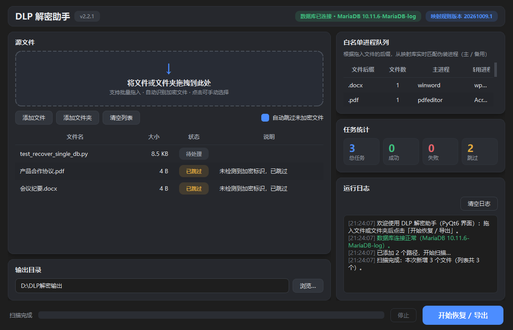

# DLP-Pass

> **⚠️ 用途声明（请务必阅读）**
>
> 本工具面向**自有或已获授权的企业 DLP（数据防泄漏）透明加密环境**，用于将已加密文件
> 批量恢复为明文（如：离职交接、资料归档、系统迁移、日常取数）。
> 请仅在**你有权处置这些文件**的场景下使用，并遵守所在组织的保密制度与当地法律法规。
> **严禁用于任何未经授权的场景。**

Windows 桌面工具（深色界面）：批量恢复被 DLP 透明加密的文件为明文。
将文件或文件夹拖入窗口即可批量处理——自动识别加密状态、匹配导出进程、校验导出结果。

## 界面预览



## 功能特性

- 拖拽文件 / 文件夹批量解密，自动跳过未加密文件
- 现代化深色界面：任务列表、实时日志、进度条、状态徽标与统计卡片
- 自动密文检测与导出结果校验（确保最终输出为明文）
- 可选数据库映射：从 MariaDB 集中读取「文件后缀 → 导出进程」规则，失败自动回退
- 可选解密审计：记录计算机名、公网 IP、文件路径、结果与报错信息
- 单文件绿色版：内置全部运行环境与模板，无需安装 Python

## 快速开始

1. 下载本仓库中的 `DLP-Pass.exe`（或 Release 附件）
2. 双击运行 —— **开箱即用：无需安装、无需任何配置**
3. 将需要恢复的文件 / 文件夹拖入窗口 → 选择「输出目录」→ 点击「**开始恢复 / 导出**」
4. 处理进度与结果实时显示在列表与「运行日志」中；文件夹拖入时会保留原有目录结构

> 程序已内置默认运行配置（含数据库映射与审计），下载后直接使用即可。

## 运行要求

- Windows 10 / 11（64 位）
- 源文件所在的**同一 DLP 客户端环境**（读取解密数据流依赖 DLP 策略对该环境的信任，
  程序会自动委派系统进程读取，无需手动操作）
- 数据库功能（可选）：可访问的 MariaDB 5.7+ / 10.x

## 高级：覆盖默认配置（可选）

发布版已内置默认运行配置，正常使用**无需**本文件。
如需改用你自己的数据库或调整参数，可在 **exe 同目录** 放置 `config.json` 覆盖内置默认值：

```json
{
    "db": {
        "host": "10.0.0.1",
        "port": 3306,
        "user": "your-user",
        "password": "your-password",
        "database": "your-database"
    },
    "enable_operation_log": true,
    "powershell_timeout": 10.0
}
```

| 字段 | 说明 | 默认值 |
| --- | --- | --- |
| `db.*` | 数据库连接参数（集中映射与审计） | 空（不使用数据库） |
| `enable_operation_log` | 是否写入解密审计表 | `true` |
| `powershell_timeout` | 密文校验命令超时（秒） | `10.0` |

> ⚠️ 该文件包含数据库凭据，请妥善保管，**不要随 exe 一起分发或提交到仓库**。

## 命令行自检（部署验证）

```bat
DLP-Pass.exe --selftest "D:\资料\任意加密文件.pdf"
```

- 退出码：`0` 全部成功 ｜ `1` 存在解密失败 ｜ `2` 数据库连接失败
- 日志位置：`%LOCALAPPDATA%\DLP-Pass\logs\dlp_pass.log`

## 数据库（可选，供管理员配置）

<details>
<summary>展开查看建表语句（映射表 + 审计表）</summary>

**映射版本表**

```sql
CREATE TABLE sys_whitelist_version (
  id          BIGINT UNSIGNED NOT NULL AUTO_INCREMENT COMMENT '主键',
  version     VARCHAR(32)  NOT NULL COMMENT '版本号，例如: 20261009.1',
  description VARCHAR(255) DEFAULT '' COMMENT '版本说明',
  is_current  TINYINT(1)   NOT NULL DEFAULT 0 COMMENT '是否当前生效版本（1 是）',
  created_by  VARCHAR(64)  DEFAULT 'system' COMMENT '创建人',
  created_at  DATETIME     NOT NULL DEFAULT CURRENT_TIMESTAMP COMMENT '创建时间',
  PRIMARY KEY (id),
  UNIQUE KEY uk_version (version)
) ENGINE=InnoDB DEFAULT CHARSET=utf8mb4 COMMENT='白名单映射版本表';
```

**后缀 → 导出进程映射表**

```sql
CREATE TABLE sys_whitelist_mapping (
  id                    BIGINT UNSIGNED NOT NULL AUTO_INCREMENT COMMENT '主键',
  version               VARCHAR(32) NOT NULL COMMENT '所属版本（关联版本表 version）',
  file_extension        VARCHAR(32) NOT NULL COMMENT '文件后缀，如 .pdf',
  primary_process       VARCHAR(64) NOT NULL COMMENT '主导出进程名（不含 .exe）',
  alternative_processes VARCHAR(255) DEFAULT '' COMMENT '备用进程名（逗号分隔）',
  priority              INT         NOT NULL DEFAULT 0 COMMENT '同后缀优先级（大者优先）',
  status                TINYINT(1)  NOT NULL DEFAULT 1 COMMENT '是否启用（1 启用）',
  PRIMARY KEY (id),
  KEY idx_suffix (file_extension, status)
) ENGINE=InnoDB DEFAULT CHARSET=utf8mb4 COMMENT='文件后缀-导出进程映射表';
```

**解密审计表**

```sql
CREATE TABLE sys_decrypt_log (
  id            BIGINT UNSIGNED NOT NULL AUTO_INCREMENT COMMENT '自增主键',
  computer_name VARCHAR(64)   NOT NULL COMMENT '执行解密的计算机名',
  public_ip     VARCHAR(45)   DEFAULT NULL COMMENT '公网IP（curl ip.sb 获取）',
  file_path     VARCHAR(1024) NOT NULL COMMENT '被解密文件绝对路径（含文件名）',
  file_name     VARCHAR(255)  NOT NULL COMMENT '被解密文件名',
  success       TINYINT(1)    NOT NULL DEFAULT 0 COMMENT '是否成功：1=成功，0=失败',
  error_message VARCHAR(1000) DEFAULT NULL COMMENT '失败时的报错信息',
  created_at    DATETIME      NOT NULL DEFAULT CURRENT_TIMESTAMP COMMENT '记录时间',
  PRIMARY KEY (id),
  KEY idx_created_at (created_at),
  KEY idx_computer_name (computer_name),
  KEY idx_file_name (file_name)
) ENGINE=InnoDB DEFAULT CHARSET=utf8mb4 COMMENT='DLP 解密操作审计日志';
```

</details>

## 常见问题（FAQ）

- **顶部显示「数据库连接失败」** — 网络不可达或数据库服务异常（程序已内置默认配置）；
  扫描与解密等核心功能不受影响，将使用本地兜底规则。
- **解密完成后提示校验失败 / 输出仍为密文** — 当前环境的 DLP 策略未信任
  `cmd.exe` / `python.exe` 等系统进程，请联系你的 DLP 管理员确认策略。
- **首次启动或首次处理某类文件稍慢** — 单文件程序首次启动需解压运行环境（数秒）；
  首次处理某后缀文件时会释放对应进程模板，之后即快速复用。
- **一次可以处理多少文件？** — 单次上限 20000 个；`.venv`、`__pycache__`、`node_modules`
  等无关目录会自动跳过。
- **会向外发送我的数据吗？** — 不会。除你在 `config.json` 中配置的数据库外，
  程序不向任何服务器发送数据。

## 安全说明

- 发布版 exe **不包含明文形式的数据库凭据**：内置默认配置以加密载荷保存；
  如需自定义数据库，可使用本地 `config.json`（请勿提交或分发该文件）。
- 程序主体以加密载荷形式发布，可防止常规方式反编译查看源码。
- 审计写入可在配置中随时关闭（`"enable_operation_log": false`）。

## 下载校验

当前版本：**v2.2.1**

```text
SHA256(DLP-Pass.exe) = 0345462eac0428f4de91566c2c47d4c4495d09ae2f8c0821f3352a4dcd9c9846
```

## 许可

本仓库仅发布构建产物（可执行程序与说明文档）。如需授权使用或二次分发，请与作者联系。
